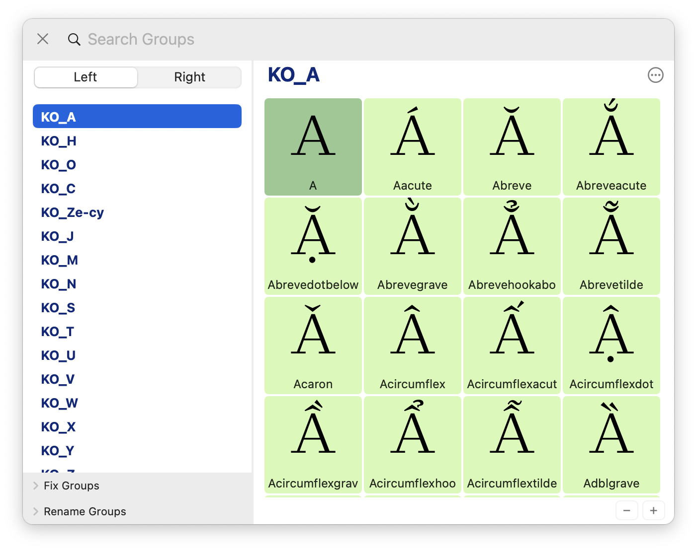
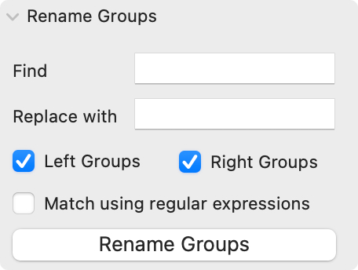
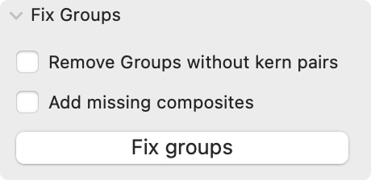

# Groups Shelf

Groups Shelf is a [Glyphs](https://glyphsapp.com/) kerning group manager.  

- Visualise and manage kerning groups 
- Rename groups while copying kerning values
- Automatically add missing composites

### Group View
Group View shows all glyphs of the kerning group. Add or remove glyphs to the selected group using − and + buttons. 

### Rename Groups palette
The palette for renaming all groups in the font. It's useful for removing or adding prefixes and sufixes, like `KO_` and `.1`. 
You could choose between substring or regular expression substitution. 

### Fix Groups palette

- Remove groups without kerning paris literally deletes those groups. 
- Add missing composites will add composite glyphs if parent glyph is presented in the group. 

### Credits 
> This project is sponsored by [bolditalic.studio](https://bolditalic.studio/)

Pavel Kolchanov, Dmitry Goloub, 2025
