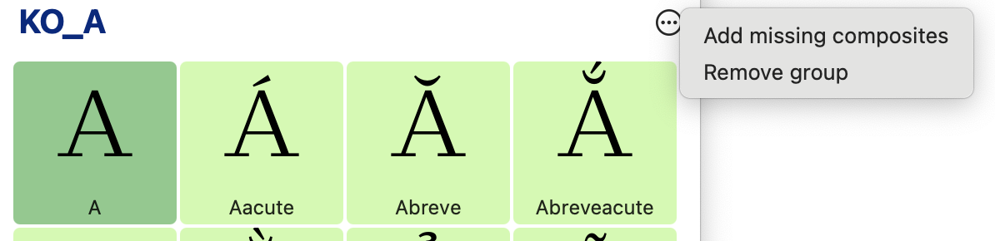
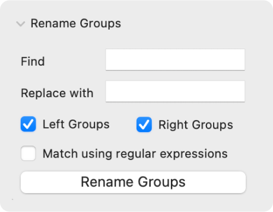
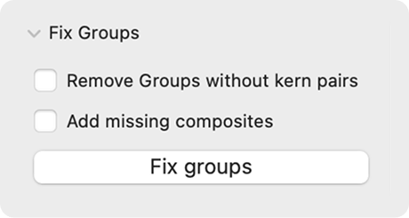

# Groups Shelf

Groups Shelf is a [Glyphs](https://glyphsapp.com/) kerning group manager.  

- Visualise and manage kerning groups 
- Rename groups while copying kerning values
- Automatically add missing composites

### Installation

1. Double-click the `GroupsShelf.glyphsPlugin`. Glyphs will show conformation pop-up. 
2. Open plugin panel using Window → Groups Shelf 

### Group View
Group View shows all glyphs of the kerning group.

- - and + buttons in the bottom will add or remove glyphs to the selected group using.  
- Remove group will remove selected goups and kerning pairs. 
- Add missing composites will add composite glyphs if parent glyph is presented in the group. For example, if `A` is in the group, `Á` will be added. 

### Rename Groups palette
The palette for renaming all groups in the font. It's useful for removing or adding prefixes and suffixes, like `KO_` and `.1`. 
You could choose between substring or regular expression substitution. 

### Fix Groups palette

- Remove groups without kerning paris literally deletes those groups. 
- Add missing composites will add composites for all groups.

### Credits 
> This project is sponsored by [bolditalic.studio](https://bolditalic.studio/)

Pavel Kolchanov, Dmitry Goloub, 2025
